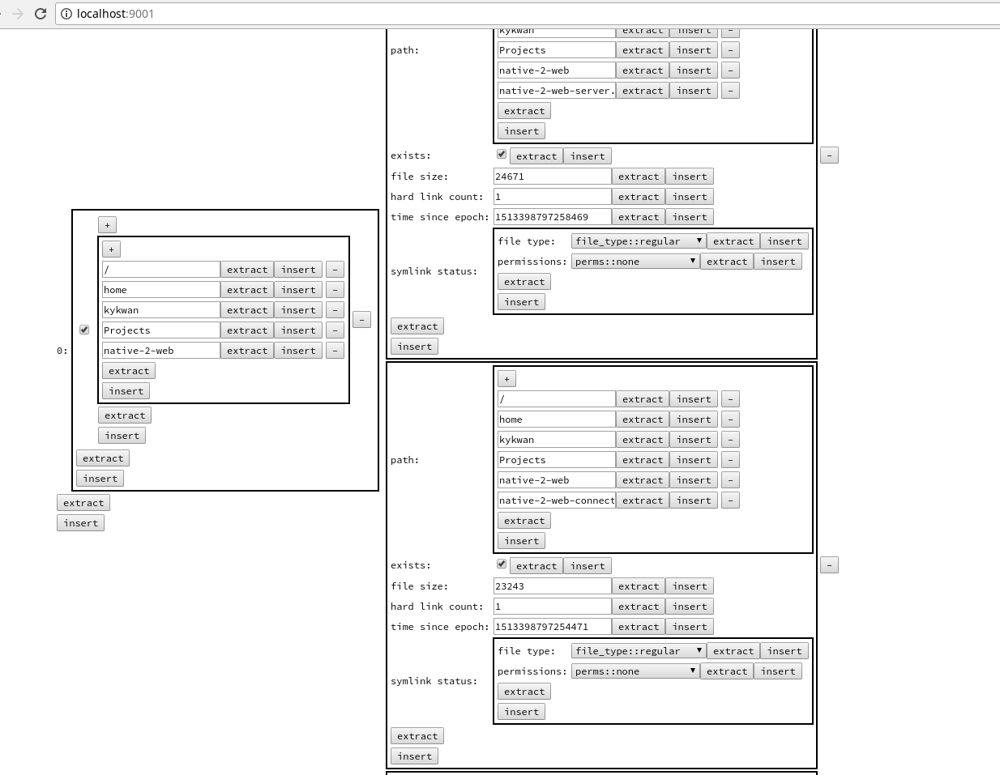

This project is licenced under GPL. Contact me for a commercial licence or for commercial support, or support me via [Patreon](https://patreon.com/king_yan_kwan).

native-2-web
===

Provides a library and implementation of generating web services from C++ functions over a websocket interface.

`native-2-web-server.cpp` is a complete demo showing what it takes to use the system. It also exposes the server itself as a service that can be used.

`n2w-fs.cpp` is a complete demo showing what it takes to expose C++17's filesystem API as a webservice.

The files in `oldtests` contain some useful usage examples too.

To see it in action, connect to the server via a browser.

Creating a websocket service is as easy as writing this
---
```C++
accept<http_handler>(
    io_service, ip::address::from_string(arguments["address"].as<string>()),
    arguments["port"].as<unsigned short>());
```

Of course, that's just a trick. The guts of server is in the template argument `http_handler`, which you can define even as a function-scoped class:

```C++
int main(...) {
  // ...
  struct http_handler {
    using websocket_handler_type = websocket_handler;

    http::response<http::string_body>
    operator()(const http::request<http::string_body> &request) {...}
  };
}
```

The `websocket_handler_type` inner class type is optional and can just be a type alias. If not defined, you will just have a normal HTTP server. Similarly, `operator()` for a http::request is optional. You can simply provide the `websocket_handler_type` for a purely websocket server. You can even not provide both and have a server that can't do anything.

To handle websockets, you implement a class for the `websocket_handler_type`. For example:

```C++
struct websocket_handler {
    void decorate(const http::request<http::string_body> &request,
                  http::response<http::string_body> &response) {...}

    void operator()(string message) {...}
    vector<uint8_t> operator()(vector<uint8_t> message) {...}
```
`decorate()` allows you to customize the HTTP response that Beast sends to complete the websocket handshake. It is optional.

`operator()` can be provided to take either a `string` message or a `binary` message, and can return either `string`, `binary` or `void`. `operator()`, of any overload, is also optional.

The demo implementation of `http_handler` and `websocket_handler` shows how to interpret requests and invoke the correct native API.

Exposing your native API for web is as easy as writing this
---
Implement your API using standard library types, or hook your own types via `N2W__`** macros:
```C++
// How to hook your enum into the introspection type system.
enum class recursivity : bool { RECURSIVE, NOT_RECURSIVE };
N2W__SPECIALIZE_ENUM(recursivity, N2W__MEMBERS(recursivity::RECURSIVE,
                                               recursivity::NOT_RECURSIVE));

// Your actual API (could be a top level function)
auto create_directory(
    filesystem::path path,
    optional<variant<filesystem::path, recursivity>> existing_or_recursive) {...}

// Some custom type
struct server_options {
  optional<bool> spawned = false;
  optional<string> address = boost::asio::ip::address_v6::any().to_string();
  optional<unsigned short> port = 9001;
  optional<unsigned short> port_range = 1;
  optional<unsigned> worker_threads = 0;
  optional<unsigned> accept_threads = 0;
  optional<unsigned> connect_threads = 0;
  optional<unsigned> worker_sessions = 0;
  optional<string> multicast_address = "233.252.18.0";
  optional<unsigned short> multicast_port = 9002;
};

// How to hook your custom type into the introspection type system.
N2W__BINARY_SPEC(server_options,
                 N2W__MEMBERS(address, port, port_range, worker_threads,
                              accept_threads, connect_threads, worker_sessions,
                              multicast_address, multicast_port));
// How to hook your custom type into the HTML demo GUI generator.
N2W__JS_SPEC(server_options,
             N2W__MEMBERS(address, port, port_range, worker_threads,
                          accept_threads, connect_threads, worker_sessions,
                          multicast_address, multicast_port));

// Your actual API (could be a lambda or function object)
static auto spawn_server = [](optional<server_options> options) {...}
```
Then hook it into the plugin system via like so:
```C++
plugin plugin = []() {
  n2w::plugin plugin;
  plugin.register_service(N2W__DECLARE_API(create_directory), "This is an API to create directories recursively.");
  plugin.register_service(N2W__DECLARE_API(spawn_server), "Spawn a new server using the browser.");
  return plugin;
}();
```

Final steps
---
The `websocket_handler` and `http_handler` in `native-2-web-server.cpp` shows you one way to display the generated HTML diagnostic GUI for invoking those APIs by hand, and then to wire the websocket request and calling the API:
```C++
struct websocket_handler {
    // 1. Demo GUI first sends the API function to be called as a string.
    // `message` is the mangled name of the API that is automatically generated by the plugin system.
    void operator()(string message) {
      // Find the API with the mangled name `message`.
      for (auto &plugin : plugins) {
        service = cref(plugin.second.get_function(message));
        if (service.get())
          return;
      }
      service = server.get_function(message);
    }

    // 2. Then it sends the actual request data.
    vector<uint8_t> operator()(vector<uint8_t> message) {
      if (!service.get())
        return {};
      return service(message);
    }
};
```



Notes
---
Unfortunately build system organization and documentation for the internals is scant at the moment.

A side aim of this project is to keep it so small, that all the header files you see are the only ones you need. The library will continue to be designed as a toolkit and hopefully work contract frameworkitis.

Pre-requisites
---
- Boost.ASIO
- Beast HTTP and Websocket library
- Clang with C++17 support
- The dynamic linking plugin stuff is Linux-only for now
- To extend the HTML GUI stuff you need to know d3.js
